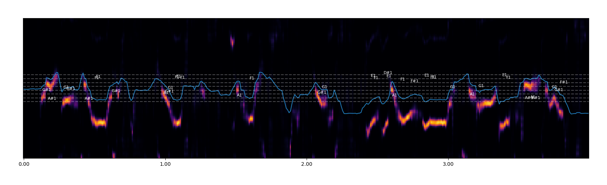

# bass_extractor

This is a Python program that allows you to extract bass notes from a piece of music.

Don't forget to install dependencies:

```
python3 -m venv venv
source venv/bin/activatee
pip install -r requirements.txt
```

## Usage:

Example for "Vlastur - Cycladic Dub":

`python3 main.py --input example/input.mp3 --start 28 --end 35  --output example/bass_out.png`


Example for "Queen - Another one bites the dust":

`python3 main.py --input example/abtd.mp3 --start 0 --end 4 --output example/queen_another_one_bites_the_dust_bass_out.png --confidence 0.7`



